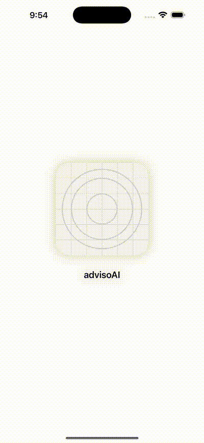
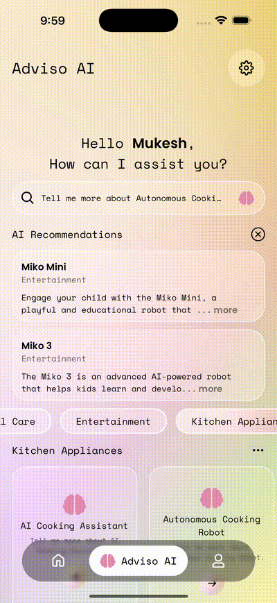

# 🤖 Adviso AI – Product Advisor with AI-Powered Chat

AdvisoAI is a **React Native (Expo)** application that helps users discover the best products using **AI-powered recommendations** and also provides a **real-time chat interface** with OpenAI, similar to ChatGPT.  

It demonstrates **architectural-level mobile engineering expertise**, delivering scalable systems, production-grade patterns, and a polished UI/UX designed with long-term evolution in mind.

---

## 📸 YouTube

[▶️ Video](https://youtu.be/pUrr-Xig9Ac)

---

## 📸 Screenshots & Demo

| Splash | Home | Adviso AI | Profile | Chat | Animated Bottom Tabs |
|--------|------|-----------|---------|------|----------------------|
|  |  |  |  |  |  |

---

## ✨ Features

### 🔍 AI Product Advisor
- Ask in plain English (*“I need a coffee machine for my office”*).  
- AdvisoAI returns the **top 3 product matches** from a local catalog.  
- Includes **reasons** for each recommendation.  
- Predefined **prompt chips** for one-tap queries.  

### 💬 Real-Time AI Chat (ChatGPT-style)
- Interactive chat UI with OpenAI.  
- Streaming-like effect with **typing indicator / Lottie animation**.  
- Persistent chat history (powered by Zustand).  
- Supports **multi-turn conversations**.  

### 🎴 UI & Experience
- **Animated Bottom Tabs** for smooth navigation.  
- **Glassmorphic Input Bar** with BlurView + brain/send buttons.  
- **FlashList** for efficient infinite scroll + header + scroll-to-top.  
- **Lottie animations** for loading states.  
- **Dark/Light theme** support with `useTheme`.  

---

## 📂 Project Structure

```
src/
 ┣ app/                   # Expo Router app entry
 ┣ assets/                # Fonts, icons, animations, screenshots
 ┣ components/            # Shared UI (Input, ProductCard, etc.)
 ┣ constants/             # Strings, theme constants
 ┣ features/              # Screen-level features (advisor, chat, tabs, auth)
 ┣ hooks/                 # Custom hooks (theme, haptics, recommendations, chat)
 ┣ services/              # API services (openai.ts, catalog.ts)
 ┣ stores/                # Zustand global stores
 ┣ styles/                # Global styles
 ┣ theme/                 # Colors, typography, spacing
 ┣ types/                 # TypeScript types/interfaces
 ┗ utils/                 # Helpers (metrics, parsers, etc.)
```

---

## 🏗️ Architecture & Approach

- **Expo Router + Bottom Tabs** → Clean navigation with animation.  
- **Feature-first foldering** → Advisor, Chat, and Auth grouped under `src/features`.  
- **Custom Hooks** →  
  - `useRecommendations` → AI product advisor logic.  
  - `useChat` → ChatGPT-style streaming effect.  
- **Zustand Stores** → Persistent state management for chat + advisor.  
- **Service Layer** → `services/openai.ts` centralizes all prompt templates + API calls.  
- **Prompt Engineering** →  
  - Advisor mode → Strict JSON enforced.  
  - Chat mode → Natural text answers.  
- **Theming** → Centralized colors + typography.  

---

## 🚀 Getting Started

### Prerequisites
- Node.js (≥20.x or 22.x with Expo SDK 53)  
- Expo CLI  

### Install Dependencies
```sh
npm install
```

### Configure Environment
Create a `.env` file in project root:
```
EXPO_PUBLIC_OPENAI_KEY=your_openai_api_key
```

### Run the App
```sh
npx expo start
```

Open on device with **Expo Go** or run on simulator.

---

## 📖 Usage

### Home Page Local Feed & Navigation
1. Open the app → Home feed loads with posts and topics from local JSON.
2. Use the search bar → Filter posts instantly from the local list.
3. Tap a topic card under “Exploring the Future of AI” → Navigates to Chat Screen pre-filled with that topic.
4. Scroll to Trending Now → View highlighted posts and tap more to expand.
5. Switch tabs from bottom navigation → Jump between 🏠 Home, 🧠 Advisor AI, and 👤 Profile.

### AI Product Advisor
1. Open the app → Input bar appears with blur effect.  
2. Type or tap a prompt chip → Press enter/brain button.  
3. Lottie animation plays while fetching.  
4. FlashList displays product cards with details + reason.  

### AI Chat
1. Switch to **Chat screen**.  
2. Type a message (e.g., *“Summarize today’s AI news”*).  
3. AI responds in real time, with a **typing animation**.  
4. Chat history persists.  

### Profile
1. Open the **Profile tab** → Your introduction is displayed with a clean, professional layout.
2. Profile picture & name appear at the top → Instantly personalizing the page.
3. Auto-scroll begins → Long introduction text flows smoothly without user effort.
4. Typing animation plays → Text appears as if being typed in real time, keeping it engaging.

---

## 📦 Dependencies

- **Expo SDK 53**  
- **Expo Router 5.1.5**  
- **React Native 0.79.6** + React 19  
- **React Navigation (Bottom Tabs)**  
- **FlashList (Shopify)**  
- **Reanimated 3**  
- **Lottie React Native**  
- **Expo Blur, Haptics, Linear Gradient**  
- **Zustand** (state management)  
- **Axios** (API requests)  

---

## 📖 Prompt Library

AdvisoAI uses **prompt engineering best practices** to ensure reliable, safe, and structured responses from OpenAI.  

### 1. Recommendation Prompt (Main Advisor)
```text
You are an AI Product Advisor.
A user has asked: "{USER_QUERY}".
From the PRODUCT_CATALOG below, pick the 3 most relevant matches.
Always include a short explanation ("reason") for why each product fits.
Do NOT invent products outside the catalog.
Respond ONLY in valid JSON array format.
PRODUCT_CATALOG: {JSON_CATALOG}
```

### 2. Strict JSON Enforcement
```text
You must respond ONLY with a JSON array.
Do not include markdown, text, explanations, or code fences.
Just raw JSON as defined.
```

---

## 📚 Future Improvements
- 🔗 Backend catalog integration (Supabase/GraphQL).  
- 👤 Personalized advisor suggestions.  
- 📊 Product comparison mode.  
- 🛒 Wishlist / cart flow.  
- 🔔 Push notifications for saved prompts & chats.  

---

## 👨‍💻 Author

Developed by **Mukesh Kumar (Rishu)** – Senior React Native Engineer  
Software Development Engineer with 9+ years of experience in building **mobile apps** (React Native, Expo, Android, iOS, JavaScript, TypeScript, AI). I design and deliver scalable, high-performance mobile applications across HealthTech, EdTech, Charity, E-Commerce, and Social Platforms — guiding projects from concept to App Store / Play Store launch.
